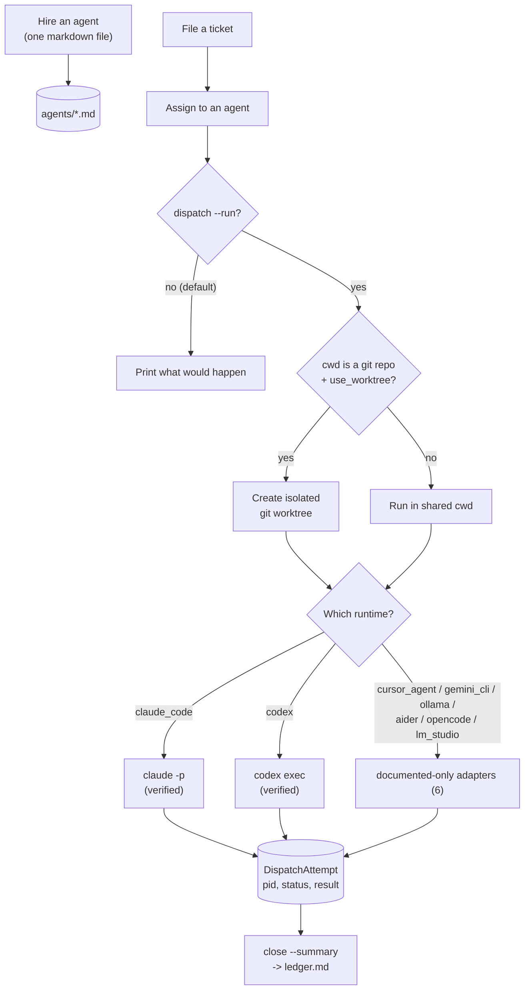

<p align="center">
  
</p>

<div align="center">

# agent-hq

### A git-native AI team you run locally

Hire agents. File tickets. Dispatch to real, live runtimes — not canned scripts.

[](https://www.python.org/)
[]()
[](LICENSE)
[](#whats-next)

</div>

---

<div align="center">

| 9 registered agents | 8 runtimes | 30 tests | New to AI agents? |
|:---:|:---:|:---:|:---:|
| One markdown file each | 2 verified live, 6 documented-only | Fully offline, real git worktree tests | Run `agent-hq onboard` |

</div>

## New to AI agents? Start here

You don't need to already know what any of this means. Quick glossary:

- **Agent** — an AI coding/writing tool (like Claude Code) registered here with a plain-English job description, so you don't have to remember its command-line flags.
- **Ticket** — a task you want done: a title and a description of what you need.
- **Dispatch** — handing a ticket to an agent and letting it actually work.
- **Runtime** — which underlying tool an agent uses (Claude Code, Codex, etc.).
- **Worktree** — a private copy of a code repo so an agent's changes don't collide with anyone else's.

Run `agent-hq onboard` and it walks you through all of this interactively — checks what's installed on your machine, and helps you register your first agent by answering a few questions, no file-editing required.

## Overview

agent-hq is a git-native platform for running a small team of AI agents locally: hire an agent (one markdown file), file a ticket, dispatch it for real. It's a positioned, honest competitor to [Livery](https://github.com/sohailmamdani/livery) — same core idea (agents and tickets as plain files, no database) — built independently, with its own tradeoffs stated plainly rather than glossed over.

**Explore:** [vs. Livery](#how-this-compares-to-livery) · [Verification](#what-verified-actually-means-here) · [How it works](#how-it-works) · [Architecture](#architecture) · [Setup](#setup) · [Usage](#usage)

---

## How this compares to Livery

| | Livery | agent-hq |
|---|---|---|
| **Runtimes** | 5 (Claude Code, Codex, Cursor, LM Studio, Ollama) | **8 registered** (those 5 plus Gemini CLI, Aider, OpenCode) — but **only 2 verified against a real run** (Claude Code, Codex). The other 6 are documented-only, and say so everywhere, not just in a footnote |
| **Worktree isolation** | Yes, via `--worktree` | Yes — real `git worktree` commands, tested against a real repo |
| **Agent assignment** | Manual (`assignee` field) | Manual (`assign` command) — same model, this isn't the routing-intelligence project (see [switchboard](https://github.com/PlainJane20/switchboard) for that) |
| **Memory** | `memory/{decisions,lessons,preferences}` | Same shape — decisions, lessons, preferences, git-tracked markdown |
| **Onboarding** | `livery onboard` guided flow | `agent-hq onboard` — plain-language glossary, `doctor` check, interactive agent registration |
| **Scheduling, Talk, Walkie-Talkie, Telegram** | Yes | Not in this version — see [What's next](#whats-next) |
| **Maturity** | Versioned, changelogged, real usage | Built this week, 24 tests, no production mileage |

The honest summary: this isn't feature parity, and doesn't claim to be. It's the same core loop (hire, ticket, dispatch, remember), built independently, with **verification status disclosed per-runtime** instead of a flat "5 adapters" claim — which is a thing Livery's own README doesn't do either, for what it's worth.

## What "verified" actually means here

Every runtime falls into exactly one of two buckets, and it's disclosed in three places: the agent registry (`agent-hq agent-list`), `agent-hq doctor`, and this table.

| Runtime | Status | What was actually checked |
|---|---|---|
| **Claude Code** | ✅ Verified | Flags checked against `claude --help` on the real installed CLI; JSON response shape taken from one real `claude -p` call; a full dispatch proven end-to-end (real session id, real cost) |
| **Codex** | ✅ Verified | Flags checked against `codex exec --help`; proven with a real invocation (`-s read-only -o <file>`, exit 0, correct output) |
| **Cursor** | 📄 Documented only | Built from Cursor's official CLI docs. cursor-agent isn't installed in this environment — nothing here has been run for real |
| **Ollama** | 📄 Documented only | Built from Ollama's official API reference. No server was running in this environment |
| **Gemini CLI** | 📄 Documented only | Built from Google's docs, which have real gaps (no documented working-directory or auto-approve flag) — this adapter only implements read-only access as a result, and says why |
| **Aider** | 📄 Documented only | Built from Aider's scripting docs. `read_only` on this one is the least-verified setting in the whole registry — the docs don't confirm what happens to a proposed edit with nothing to answer its confirmation prompt |
| **OpenCode** | 📄 Documented only | Built from OpenCode's CLI docs. `--format json` is documented as "raw events," not one clean object — this adapter's parser is a best-effort guess, and says so |
| **LM Studio** | 📄 Documented only | Built from LM Studio's docs, which describe the endpoint as OpenAI-compatible — a safe assumption, still not independently re-confirmed against a real response |

### Why the list stops at 8, when a lot more tools exist

Terminal/CLI agents, AI-native IDEs, fully autonomous cloud agents, and no-code app builders are all real and popular — but most of them structurally aren't a "runtime adapter" in the sense this tool needs one:

- **IDE extensions, not standalone tools** (Cursor's editor mode, Windsurf, Zed AI, PearAI, Cline, Roo Code, Continue) — these live inside an editor; there's no CLI to spawn as a subprocess.
- **Cloud-only, no local invocation surface** (Devin, Replit Agent, GitHub Copilot's autonomous agent, Augment Code, v0, Bolt.new, Lovable.dev) — web products, some with APIs that need accounts/keys this project doesn't have and can't verify.
- **Models, not agent harnesses** (Kimi K3, GLM 5.2, and raw llama.cpp) — you'd reach these *through* something like Ollama's or LM Studio's API, not as a runtime in their own right.
- **Terminal environments that host other harnesses, not a harness themselves** (Warp) — Warp's own value is wrapping other agents (including some already registered here); there's no distinct "Warp agent" CLI separate from the tools it hosts.
- **No stable, documentable CLI to build against** (Devika) — an open-source Devin alternative, but without the kind of official, versioned CLI reference the other adapters here are built from; adding it now would mean guessing, which is exactly what every other adapter here was built specifically to avoid.

Cursor CLI (`cursor-agent`, distinct from the editor), Aider, and OpenCode all made the cut because each is a real, documentable non-interactive CLI — same category as Claude Code and Codex, just not installed here to verify live.

---

## How it works

1. **Hire** an agent — one markdown file: what tool it uses, what it's for, how much access it gets (`tool_access: read_only / standard / full` — a plain dial, not raw CLI flags)
2. **File a ticket** — title, tags, a description of what you need
3. **Assign** it to an agent (manually — this tool doesn't guess who should do it)
4. **Dispatch** — prints what would happen by default; `--run` does it for real
5. If the agent's `cwd` is a git repo, dispatch runs in its own **worktree** — created fresh, left in place afterward so you can review or merge what it did
6. Every dispatch is tracked as a durable **attempt** (PID, status, result) so "did that actually work" always has an answer
7. Record durable **memory** — decisions, lessons, preferences — that persists across sessions, independent of any one ticket

## Architecture



Full design rationale — including the exact commands run to verify Claude Code and Codex, and why worktrees are left in place instead of auto-removed — is in [ARCHITECTURE.md](ARCHITECTURE.md).

---

## Real findings from building and testing this

- **A fresh `git init` with zero commits has no HEAD to branch a worktree off of.** The raw git error (`fatal: not a valid object name: 'HEAD'`) says nothing useful to a beginner. `create_worktree` now catches this specific case and explains it in plain language. Caught by actually dispatching to a real git-backed agent during development, not written defensively in advance.
- **A "verified" adapter that only works under one auth configuration isn't actually verified.** Claude Code's `--bare` mode looked like the obvious default for scripted calls; it fails outright on a machine where managed settings pin OAuth login. The adapter omits it.
- **Some official docs have real gaps.** Gemini CLI's headless-mode page doesn't document a working-directory flag or an auto-approval flag. Rather than guess, the adapter only implements `read_only` access and says exactly why in its own docstring.
- **`--output-last-message <file>` beats parsing stdout.** A real `codex exec` run's stdout is full of banner and progress text ahead of the actual answer; the file argument gets written with just the final message.
- **"Documented" isn't one confidence level -- some docs are gappier than others.** Aider's scripting docs don't say what happens to an edit with no way to confirm it; OpenCode's own docs describe its JSON output as "raw events" rather than a single object. Both adapters are built and tested, but their docstrings say exactly which specific behavior is a best-effort guess, rather than letting "documented" imply more confidence than the source material actually supports.

Worktree isolation, proven the same way — not asserted. A real dispatch to a file-editing agent (`tool_access: standard`) created `worktree-proof.txt`, and afterward:

```
$ ls worktree-proof.txt                 # main working tree
ls: worktree-proof.txt: No such file or directory

$ cat .agent-hq/worktrees/0003-*/worktree-proof.txt
worktree isolation works.

$ git status --short                    # main tree, after the dispatch
 M tickets/0003-create-a-scratch-file.md
```

The file exists only in the isolated worktree. The main tree's only change is the ticket status update this tool itself made — nothing the agent did leaked outside its sandbox.

## What's next

- [x] Two verified live runtimes (Claude Code, Codex), six documented (Cursor, Ollama, Gemini CLI, Aider, OpenCode, LM Studio)
- [x] Real git worktree isolation, tested against a real repo
- [x] Generalized memory (decisions, lessons, preferences)
- [x] Beginner-friendly onboarding (`onboard`, `doctor`, interactive `agent-hire`)
- [ ] Automatic routing — this tool assigns manually, on purpose; see [switchboard](https://github.com/PlainJane20/switchboard) for the automatic-routing version of this idea
- [ ] Scheduling, Talk mode, Walkie-Talkie debate, Telegram-style notifications — all real ideas, not built in this version
- [ ] Getting any documented-only adapter to "verified" — needs that tool actually installed and a real dispatch run against it; the code is ready, the proof isn't

## Setup

```bash
python3 -m venv .venv
source .venv/bin/activate
pip install -e ".[dev]"     # installs the real `agent-hq` command
pytest tests/ -v             # fully offline -- real git worktree tests, mocked runtime calls
```

No API keys to configure here — auth is handled by whichever tool's CLI you're dispatching to (`claude`, `codex`, etc. use their own existing login).

## Usage

```bash
# New to this? Start here -- guided setup, no prior knowledge needed
agent-hq onboard

# Check what's actually installed and usable on this machine
agent-hq doctor

# Register an agent interactively (or hand-write a markdown file -- see agents/README.md)
agent-hq agent-hire
agent-hq agent-list

# File a ticket and assign it
agent-hq ticket-new --title "Summarize this doc" --tags research --body "..."
agent-hq assign 0001 claude-researcher

# See what dispatching would do -- prints only, nothing runs
agent-hq dispatch 0001

# Actually run it
agent-hq dispatch 0001 --run

# Full ticket detail, including every dispatch attempt
agent-hq ticket-show 0001

# See active worktrees, remove one when you're done reviewing it
agent-hq worktree-list
agent-hq worktree-remove 0001 --repo /path/to/the/repo

# Record something worth remembering across sessions
agent-hq memory-add --type lesson --title "..." --body "..."
agent-hq memory-search "worktree"

# Close it out
agent-hq close 0001 --summary "Done."
agent-hq board
```

## Repository map

```text
agent-hq/
├── agent_hq/
│   ├── models.py             Agent, Ticket, DispatchAttempt, MemoryEntry -- verification tier lives here
│   ├── frontmatter.py        Minimal YAML-frontmatter markdown parsing
│   ├── registry.py           Loads agents/*.md
│   ├── tickets.py            Create/list/update/close; lock-guarded id allocation
│   ├── memory.py             decisions/lessons/preferences -- git-tracked, simple search
│   ├── worktree.py           Real git worktree create/list/remove
│   ├── attempts.py           Durable dispatch attempt records
│   ├── doctor.py             Checks what's actually installed + discloses verification tier
│   ├── dispatch.py           Ties runtime + worktree + attempts together
│   ├── runtimes/
│   │   ├── claude_code.py    VERIFIED
│   │   ├── codex.py          VERIFIED
│   │   ├── cursor_agent.py   documented only
│   │   ├── ollama.py         documented only
│   │   ├── gemini_cli.py     documented only, read_only-only
│   │   ├── aider.py          documented only, read_only is the least-verified setting here
│   │   ├── opencode.py       documented only, best-effort JSON-events parser
│   │   └── lm_studio.py      documented only, OpenAI-compatible response shape assumed
│   └── cli.py                `agent-hq <command>`, including the onboard wizard
├── agents/                   Nine example agents, one per runtime (two on claude_code)
├── tickets/                  Three real tickets, dispatched for real to prove it works
├── memory/{decisions,lessons,preferences}/
├── tests/                    30 tests -- real git for worktrees, mocked subprocess/HTTP for runtimes
└── ARCHITECTURE.md           Design rationale, decision by decision
```

---

## Contact

<div align="center">

### Navi Sohi

*Technical Program Manager & Automation Engineer*

<a href="https://www.linkedin.com/in/navisohi/"></a>
<a href="https://github.com/PlainJane20"></a>
<a href="mailto:nks.ai.dev@gmail.com"></a>

</div>

## License

Copyright © 2026 Navi Sohi.

This project is distributed under the [MIT License](LICENSE). Reuse is permitted under the
license terms, provided the copyright and license notice are retained in copies or substantial
portions of the software.
