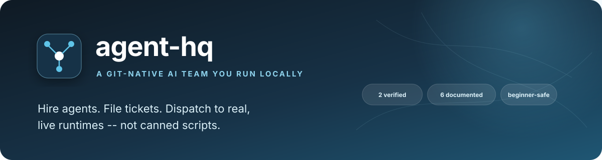
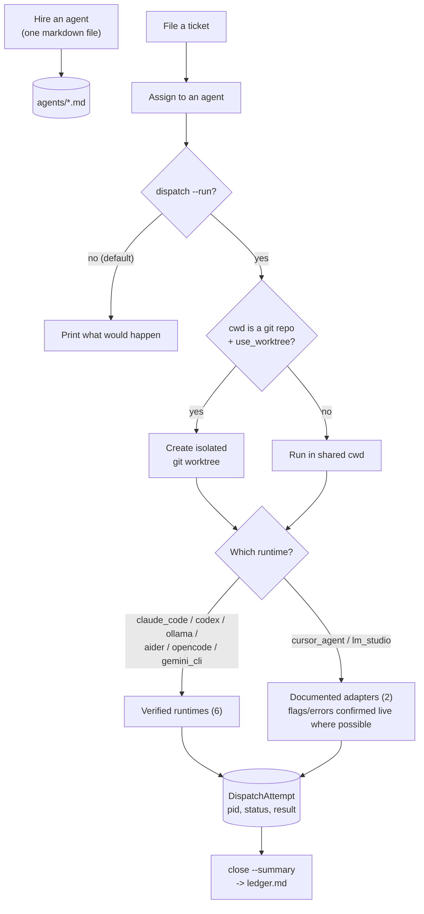

<p align="center">
  
</p>

<div align="center">

# agent-hq

### A git-native AI team you run locally

Hire agents. File tickets. Dispatch to real, live runtimes — not canned scripts.

[](https://www.python.org/)
[]()
[](LICENSE)
[](#whats-next)

</div>

---

<div align="center">

| 12 registered agents | 8 runtimes | 46 tests | New to AI agents? |
|:---:|:---:|:---:|:---:|
| One markdown file each | 6 verified live, 2 documented (flags/errors confirmed live) | Fully offline, real git worktree tests | Run `agent-hq onboard` |

</div>

## New to AI agents? Start here

You don't need to already know what any of this means. Quick glossary:

- **Agent** — an AI coding/writing tool (like Claude Code) registered here with a plain-English job description, so you don't have to remember its command-line flags.
- **Ticket** — a task you want done: a title and a description of what you need.
- **Dispatch** — handing a ticket to an agent and letting it actually work.
- **Runtime** — which underlying tool an agent uses (Claude Code, Codex, etc.).
- **Worktree** — a private copy of a code repo so an agent's changes don't collide with anyone else's.

Run `agent-hq onboard` and it walks you through all of this interactively — checks what's installed on your machine, and helps you register your first agent by answering a few questions, no file-editing required.

## Overview

agent-hq is a git-native platform for running a small team of AI agents locally: hire an agent (one markdown file), file a ticket, dispatch it for real. It's a positioned, honest competitor to [Livery](https://github.com/sohailmamdani/livery) — same core idea (agents and tickets as plain files, no database) — built independently, with its own tradeoffs stated plainly rather than glossed over.

**Explore:** [vs. Livery](#how-this-compares-to-livery) · [Verification](#what-verified-actually-means-here) · [How it works](#how-it-works) · [Architecture](#architecture) · [Setup](#setup) · [Usage](#usage)

---

## How this compares to Livery

| | Livery | agent-hq |
|---|---|---|
| **Runtimes** | 5 (Claude Code, Codex, Cursor, LM Studio, Ollama) | **8 registered** (those 5 plus Gemini CLI, Aider, OpenCode) — **6 verified against real runs** (Claude Code, Codex, Ollama, Aider, OpenCode, Gemini CLI — the last four installed and tested live, three with a real API key/local model, after the first pass shipped as "documented"). The other 2 (Cursor, LM Studio) had real install/CLI attempts too — each blocked from a full dispatch by something concrete and disclosed (a missing credential for Cursor, no GUI session for LM Studio), not left untested by choice |
| **Worktree isolation** | Yes, via `--worktree` | Yes — real `git worktree` commands, tested against a real repo |
| **Agent assignment** | Manual (`assignee` field) | Manual (`assign` command) — same model, this isn't the routing-intelligence project (see [switchboard](https://github.com/PlainJane20/switchboard) for that) |
| **Memory** | `memory/{decisions,lessons,preferences}` | Same shape — decisions, lessons, preferences, git-tracked markdown |
| **Onboarding** | `livery onboard` guided flow | `agent-hq onboard` — plain-language glossary, `doctor` check, interactive agent registration |
| **Scheduling, Talk, Walkie-Talkie, Telegram** | Yes | Not in this version — see [What's next](#whats-next) |
| **Maturity** | Versioned, changelogged, real usage | Built this week, 24 tests, no production mileage |

The honest summary: this isn't feature parity, and doesn't claim to be. It's the same core loop (hire, ticket, dispatch, remember), built independently, with **verification status disclosed per-runtime** instead of a flat "5 adapters" claim — which is a thing Livery's own README doesn't do either, for what it's worth.

## What "verified" actually means here

Every runtime falls into exactly one of two buckets, and it's disclosed in three places: the agent registry (`agent-hq agent-list`), `agent-hq doctor`, and this table.

| Runtime | Status | What was actually checked |
|---|---|---|
| **Claude Code** | ✅ Verified | Flags checked against `claude --help` on the real installed CLI; JSON response shape taken from one real `claude -p` call; a full dispatch proven end-to-end (real session id, real cost) |
| **Codex** | ✅ Verified | Flags checked against `codex exec --help`; proven with a real invocation (`-s read-only -o <file>`, exit 0, correct output) |
| **Ollama** | ✅ Verified | Installed via Homebrew, pulled a real model, called the actual running server through this exact adapter — real response returned |
| **Aider** | ✅ Verified, with a real caveat found | Installed via pip, pointed at the local Ollama server — but a live edit dispatch revealed that "Applied edit" + exit 0 does **not** guarantee a persisted change (see [Real findings](#real-findings-from-building-and-testing-this)) |
| **OpenCode** | ✅ Verified | Installed via npm, pointed at the local Ollama server — but only after finding its `--format json` parser was guessing the wrong field; fixed against a real captured response before shipping |
| **Cursor** | 📄 Documented, flags confirmed live | Installed for real (the official install script) and every flag checked against the real `--help` — all correct on the first try. A full dispatch needs a `CURSOR_API_KEY`, which requires a paid Cursor subscription (no free tier). Gemini CLI had this exact gap and got a free key to close it; Cursor's stays open by deliberate choice — not worth paying for a subscription just to finish verifying an adapter |
| **Gemini CLI** | ✅ Verified | The *original* docstring was itself wrong — built from a secondary summary that missed real flags (`--approval-mode`, `--include-directories`). Installing the real CLI surfaced and fixed that, plus two silent gotchas: `--approval-mode` reverts to `default` in an untrusted directory, and (more than first thought) `--skip-trust` is required unconditionally, not just alongside a requested approval mode. A real `GEMINI_API_KEY` and a real dispatch through the full pipeline (ticket → assign → dispatch) confirmed a correct response end-to-end |
| **LM Studio** | 📄 Documented only, real structural blocker found | `brew install --cask lm-studio` genuinely installed it (v0.4.23) — but it's a GUI-first Electron app, and this environment has no window-server session for it to attach to. Launching it falls through to its embedded Node runtime's own `--help` instead of starting the app, so its CLI/server never bootstraps. Unlike Cursor/Gemini, this isn't a missing-credential gap — it needs an actual desktop session, not just more installing |

### Why the list stops at 8, when a lot more tools exist

Terminal/CLI agents, AI-native IDEs, fully autonomous cloud agents, and no-code app builders are all real and popular — but most of them structurally aren't a "runtime adapter" in the sense this tool needs one:

- **IDE extensions, not standalone tools** (Cursor's editor mode, Windsurf, Zed AI, PearAI, Cline, Roo Code, Continue) — these live inside an editor; there's no CLI to spawn as a subprocess.
- **Cloud-only, no local invocation surface** (Devin, Replit Agent, GitHub Copilot's autonomous agent, Augment Code, v0, Bolt.new, Lovable.dev) — web products, some with APIs that need accounts/keys this project doesn't have and can't verify.
- **Models, not agent harnesses** (Kimi K3, GLM 5.2, and raw llama.cpp) — you'd reach these *through* something like Ollama's or LM Studio's API, not as a runtime in their own right.
- **Terminal environments that host other harnesses, not a harness themselves** (Warp) — Warp's own value is wrapping other agents (including some already registered here); there's no distinct "Warp agent" CLI separate from the tools it hosts.
- **No stable, documentable CLI to build against** (Devika) — an open-source Devin alternative, but without the kind of official, versioned CLI reference the other adapters here are built from; adding it now would mean guessing, which is exactly what every other adapter here was built specifically to avoid.

Cursor CLI (`cursor-agent`, distinct from the editor), Aider, and OpenCode all made the cut because each is a real, documentable non-interactive CLI — same category as Claude Code and Codex. Aider and OpenCode are now fully verified live; Cursor's flags are confirmed live too, just short of an authenticated dispatch (see the table above for exactly what's still missing and why).

---

## How it works

1. **Hire** an agent — one markdown file: what tool it uses, what it's for, how much access it gets (`tool_access: read_only / standard / full` — a plain dial, not raw CLI flags)
2. **File a ticket** — title, tags, a description of what you need
3. **Assign** it to an agent (manually — this tool doesn't guess who should do it)
4. **Dispatch** — prints what would happen by default; `--run` does it for real
5. If the agent's `cwd` is a git repo, dispatch runs in its own **worktree** — created fresh, left in place afterward so you can review or merge what it did
6. Every dispatch is tracked as a durable **attempt** (PID, status, result) so "did that actually work" always has an answer
7. Record durable **memory** — decisions, lessons, preferences — that persists across sessions, independent of any one ticket

## Architecture



Full design rationale — including the exact commands run to verify Claude Code and Codex, and why worktrees are left in place instead of auto-removed — is in [ARCHITECTURE.md](ARCHITECTURE.md).

---

## Real findings from building and testing this

- **A fresh `git init` with zero commits has no HEAD to branch a worktree off of.** The raw git error (`fatal: not a valid object name: 'HEAD'`) says nothing useful to a beginner. `create_worktree` now catches this specific case and explains it in plain language. Caught by actually dispatching to a real git-backed agent during development, not written defensively in advance.
- **A "verified" adapter that only works under one auth configuration isn't actually verified.** Claude Code's `--bare` mode looked like the obvious default for scripted calls; it fails outright on a machine where managed settings pin OAuth login. The adapter omits it.
- **`--output-last-message <file>` beats parsing stdout.** A real `codex exec` run's stdout is full of banner and progress text ahead of the actual answer; the file argument gets written with just the final message.
- **"Documented" isn't one confidence level -- some docs are gappier than others.** OpenCode's own docs describe its JSON output as "raw events" rather than a single object, so that parser is an explicit best-effort guess. Aider's gap turned out to be resolvable — see below.
- **"Documented" can be upgraded to "verified" by just... installing the thing.** Ollama shipped as documented-only because no server was running during initial development. Installing it via Homebrew, pulling a model, and calling the real adapter took about five minutes and turned a disclosed guess into a proven fact. Not every documented adapter needs to stay that way forever.
- **A flag that isn't in `--help`'s summary can still be real.** `--yes` looked like a wrong flag name (only `--yes-always` appears in Aider's `--help`). A live test with `--yes` proved it actually works — argparse's default prefix-matching resolves it to `--yes-always` unambiguously. Reported here as a correction to an earlier internal finding, not hidden: "looked like a bug, tested it, wasn't one" is exactly the kind of result this whole verification exercise exists to produce, not just bug reports.
- **A real bug did turn up in the same round of testing.** Aider's repo-map feature caused an 8+ minute hang with zero output against a small local model inside a real git repo — confirmed by watching the process stay alive (barely any CPU used) while a parallel direct call to the same model also stalled. `--map-tokens 0` disables just that feature and fixed it completely, confirmed with a clean rerun.
- **The sharpest finding: a tool can report success without the change actually happening.** A live edit dispatch through the *full* pipeline (ticket → worktree → Aider → local model) printed "Applied edit to README.md" and exited 0 — but `git log` in that worktree afterward showed no new commit. The small model's malformed response apparently couldn't be cleanly reconciled into a real file change, and aider reported success anyway. A `DispatchAttempt` with `status: succeeded` means "the tool didn't error," not "the requested change provably happened" — verifying the latter means checking the worktree yourself.
- **A registered model name isn't the same as a reachable model.** OpenCode's `--model ollama/llama3.2:1b` failed with `ProviderModelNotFoundError: Did you mean: ollama-cloud?` — its built-in "ollama" is a cloud offering, not a pointer to a local server. Reaching the real local Ollama instance needed a custom provider block in `~/.config/opencode/opencode.jsonc`, config this adapter can't set up on a user's behalf, so it's documented instead of silently assumed away.
- **An untested best-effort parser guessed the wrong field, and the fallback chain caught it.** OpenCode's docs describe its JSON output as "raw events" with no example. An initial guess assumed a top-level `text` key; a real captured run showed the actual text lives at `event["part"]["text"]`. The bug never surfaced as a crash — it silently fell through to the raw-stdout fallback — which is exactly the failure mode a fallback chain exists to catch quietly, but also exactly why it needed to be checked against real output before shipping, not trusted just because it didn't error.
- **Even "documented" claims can be wrong if the documentation itself was second-hand.** Gemini CLI's original adapter was built from a *summary* of Google's docs, not the primary source — that summary missed real flags (`--approval-mode`, `--include-directories`) and led the original adapter to wrongly claim neither existed. Installing the real CLI and reading its actual `--help` output caught this. Lesson: "documented" is only as trustworthy as the documentation actually consulted.
- **A flag can exist, be spelled correctly, and still silently do nothing.** Gemini CLI's `--approval-mode auto_edit` in an untrusted directory printed a warning and quietly reverted to `default` — same class of bug as a flag being ignored outright, just harder to notice because the command still exits 0. `--skip-trust` must be passed alongside it, confirmed by triggering the silent downgrade directly, not inferred from docs.
- **The same flag turned out to be needed even more than that first finding suggested.** Getting a real `GEMINI_API_KEY` and running an actual authenticated dispatch showed `--skip-trust` isn't just needed alongside a *requested* approval mode — Gemini CLI refuses to run at all in an untrusted directory (exit 55), even at `read_only`, which sends no `--approval-mode` flag whatsoever. The adapter now sends `--skip-trust` unconditionally. Caught only by actually getting a key and dispatching for real, not by re-reading `--help` more carefully.
- **A GUI-only tool is a different kind of "can't verify" than a missing API key.** LM Studio really did install via `brew install --cask lm-studio` — but this environment has no window-server session, so the app can never complete first-run setup; attempting to launch it falls through to its embedded Electron/Node runtime's own bare `--help` output instead of starting anything. Cursor is one credential away from a full dispatch (Gemini CLI got that credential and is now fully verified); LM Studio needs an actual desktop session, and no amount of further installing changes that here.
- **The fix for "reported success ≠ real change" had its own bug, caught on the first real dispatch it ran against.** The new `filesystem_verified` check (see What's next) initially counted *any* uncommitted change as proof something real happened. A live Aider dispatch that reported success but changed nothing still passed that check, because Aider's own `.gitignore` housekeeping ("Added .aider* to .gitignore") counted as a change. Filtering out dotfile-only diffs before deciding "yes, something changed" fixed it — confirmed by rerunning the identical dispatch and watching the warning correctly appear.
- **Proving *something* changed isn't the same as proving the *right* thing changed.** A follow-up real dispatch asking Aider to append a line to README.md instead committed a new, literally-named file called `Verified by agent-hq.` with no content. `filesystem_verified` correctly read `True` — a real commit did happen — but it wasn't the requested edit. This is now a stated scope boundary in the code, not a false claim of correctness: the check answers "did the tool do something real," not "did the tool do the right thing."

Worktree isolation, proven the same way — not asserted. A real dispatch to a file-editing agent (`tool_access: standard`) created `worktree-proof.txt`, and afterward:

```
$ ls worktree-proof.txt                 # main working tree
ls: worktree-proof.txt: No such file or directory

$ cat .agent-hq/worktrees/0003-*/worktree-proof.txt
worktree isolation works.

$ git status --short                    # main tree, after the dispatch
 M tickets/0003-create-a-scratch-file.md
```

The file exists only in the isolated worktree. The main tree's only change is the ticket status update this tool itself made — nothing the agent did leaked outside its sandbox.

## What's next

- [x] Six verified live runtimes (Claude Code, Codex, Ollama, Aider, OpenCode, Gemini CLI); two documented with real install/CLI attempts (Cursor, LM Studio)
- [x] Real git worktree isolation, tested against a real repo, including a real (imperfect) file-editing dispatch through the full pipeline
- [x] Generalized memory (decisions, lessons, preferences)
- [x] Beginner-friendly onboarding (`onboard`, `doctor`, interactive `agent-hire`)
- [x] Verifying dispatch success against the actual filesystem state, not just exit code + stdout — `DispatchAttempt.filesystem_verified` now cross-checks a real `git` diff/log against a reported success for standard/full dispatches. Building it surfaced two more real bugs on the first two live dispatches it ran against: a tool's own housekeeping file (Aider's `.gitignore`) initially counted as "a real change" when the actual requested edit hadn't happened; and a *correctly detected* real change can still be the *wrong* one (a follow-up dispatch committed a new file literally named after the requested text instead of editing README.md). Both are documented in `worktree.py` and `models.py` — this check proves something changed, not that the right thing changed
- [ ] Automatic routing — this tool assigns manually, on purpose; see [switchboard](https://github.com/PlainJane20/switchboard) for the automatic-routing version of this idea
- [ ] Scheduling, Talk mode, Walkie-Talkie debate, Telegram-style notifications — all real ideas, not built in this version
- [x] ~~Getting Cursor to fully "verified"~~ — deliberately stopped here. Every flag and error shape is confirmed live; the only remaining gap is an authenticated success response, which needs a paid `CURSOR_API_KEY` (no free tier, unlike Gemini's). Decided not to pay for a subscription just to close out one adapter's verification — this is a disclosed, cost-based stopping point, not an oversight. The exact steps to finish it if that ever changes are in `cursor_agent.py`'s docstring
- [ ] Getting LM Studio to "verified" at all — needs a machine with a real interactive desktop session, not just another install attempt

## Setup

```bash
python3 -m venv .venv
source .venv/bin/activate
pip install -e ".[dev]"     # installs the real `agent-hq` command
pytest tests/ -v             # fully offline -- real git worktree tests, mocked runtime calls
```

No API keys to configure here — auth is handled by whichever tool's CLI you're dispatching to (`claude`, `codex`, etc. use their own existing login).

## Usage

```bash
# New to this? Start here -- guided setup, no prior knowledge needed
agent-hq onboard

# Check what's actually installed and usable on this machine
agent-hq doctor

# Register an agent interactively (or hand-write a markdown file -- see agents/README.md)
agent-hq agent-hire
agent-hq agent-list

# File a ticket and assign it
agent-hq ticket-new --title "Summarize this doc" --tags research --body "..."
agent-hq assign 0001 claude-researcher

# See what dispatching would do -- prints only, nothing runs
agent-hq dispatch 0001

# Actually run it
agent-hq dispatch 0001 --run

# Full ticket detail, including every dispatch attempt
agent-hq ticket-show 0001

# See active worktrees, remove one when you're done reviewing it
agent-hq worktree-list
agent-hq worktree-remove 0001 --repo /path/to/the/repo

# Record something worth remembering across sessions
agent-hq memory-add --type lesson --title "..." --body "..."
agent-hq memory-search "worktree"

# Close it out
agent-hq close 0001 --summary "Done."
agent-hq board
```

## Repository map

```text
agent-hq/
├── agent_hq/
│   ├── models.py             Agent, Ticket, DispatchAttempt, MemoryEntry -- verification tier lives here
│   ├── frontmatter.py        Minimal YAML-frontmatter markdown parsing
│   ├── registry.py           Loads agents/*.md
│   ├── tickets.py            Create/list/update/close; lock-guarded id allocation
│   ├── memory.py             decisions/lessons/preferences -- git-tracked, simple search
│   ├── worktree.py           Real git worktree create/list/remove
│   ├── attempts.py           Durable dispatch attempt records
│   ├── doctor.py             Checks what's actually installed + discloses verification tier
│   ├── dispatch.py           Ties runtime + worktree + attempts together
│   ├── runtimes/
│   │   ├── claude_code.py    VERIFIED
│   │   ├── codex.py          VERIFIED
│   │   ├── ollama.py         VERIFIED (installed + tested live after shipping as documented)
│   │   ├── aider.py          VERIFIED, with a real caveat -- "succeeded" doesn't guarantee a persisted change
│   │   ├── opencode.py       VERIFIED (installed + tested live; fixed a real parser bug first)
│   │   ├── gemini_cli.py     VERIFIED (real GEMINI_API_KEY, real dispatch through the full pipeline)
│   │   ├── cursor_agent.py   documented -- flags/error shape confirmed live, blocked by missing API key
│   │   └── lm_studio.py      documented -- real install attempted, blocked by no GUI session in this environment
│   └── cli.py                `agent-hq <command>`, including the onboard wizard
├── agents/                   Ten example agents across 8 runtimes (two each on claude_code and aider)
├── tickets/                  Five real tickets, dispatched for real to prove it works
├── memory/{decisions,lessons,preferences}/
├── tests/                    32 tests -- real git for worktrees, mocked subprocess/HTTP for runtimes
└── ARCHITECTURE.md           Design rationale, decision by decision
```

---

## Contact

<div align="center">

### Navi Sohi

*Technical Program Manager & Automation Engineer*

<a href="https://www.linkedin.com/in/navisohi/"></a>
<a href="https://github.com/PlainJane20"></a>
<a href="mailto:nks.ai.dev@gmail.com"></a>

</div>

## License

Copyright © 2026 Navi Sohi.

This project is distributed under the [MIT License](LICENSE). Reuse is permitted under the
license terms, provided the copyright and license notice are retained in copies or substantial
portions of the software.
